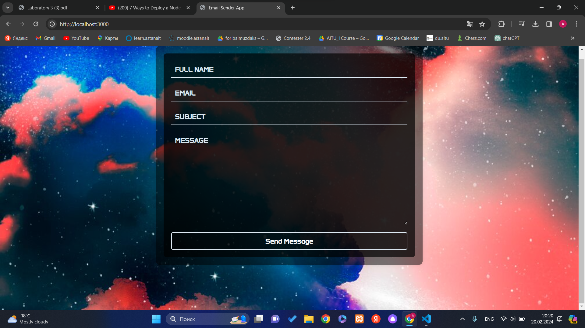

# Email Sender App

This is a simple web application built with Node.js and Express.js that allows users to send emails with attachments.

## Features of this App

- Send emails to recipients with specified subject, message, and optional attachment.
- Supports file uploads for attachments.
- Uses Nodemailer to send emails.

## Installation

1. Navigate to the project directory: cd email-application

2. Install dependencies: npm install

3. Create a .env file in the root directory and add the following environment variables:
   PORT=3000
   EMAIL_USER = f84079521@gmail.com
   EMAIL_PASSWORD= xflf eobt ehak qaas
  

## Technologies Used

- Node.js
- Express.js
- Nodemailer

## Challenges and Lessons

During the development of the project some challenges were met like, using some Email related libraries and styling the html page. Nevertheless, I have learned how to connect Nodemailer to the project, and how can I use it, therfore the lab was really helpful!
